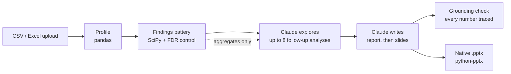

# Data to Deck

[](https://github.com/bertjosephp/AI-Powered-Data-Analysis-and-Slide-Generator/actions/workflows/ci.yml)
[](https://github.com/bertjosephp/AI-Powered-Data-Analysis-and-Slide-Generator/actions/workflows/deploy.yml)

**Upload a spreadsheet, ask a question, and get statistically tested findings, a cited answer from Claude, and an editable PowerPoint deck.**

**[Try the live demo →](https://data-to-deck.vercel.app)**
The API runs on a free server that sleeps when idle, so the first visit can take up to a minute to wake it. The page says when that's happening.

## How it works



1. **Test.** A deterministic battery runs real analyses: segment comparisons, driver rankings, threshold bands, trends with seasonality, and Pareto concentration. Every result has an effect size and a p-value, and significance is controlled across the battery with Benjamini-Hochberg. It filters out tautologies (like margin explained by revenue minus cost), duplicate splits and noise.
2. **Explain.** Claude reads the ranked findings and the dataset profile, **never the rows**. It can run up to 8 follow-up analyses on the server-side data (for example, "overtime within Sales only"), then answers your question with every claim citing finding IDs.
3. **Present.** The story becomes a native, editable PowerPoint deck with real charts. Chart and KPI values are computed from the data, not written by the model. The browser shows the same deck, with a presenter mode.

## Why trust the numbers

- **Planted-pattern eval (runs in CI).** Four synthetic datasets have known effects planted in them, plus pure-noise columns. The battery must recover every planted pattern and flag none of the noise:

  | Dataset | Rows × columns | Planted patterns found | Noise columns flagged |
  |---|---|---|---|
  | E-commerce orders | 5,000 × 22 | 5 / 5 | 0 of 3 |
  | SaaS subscriptions | 3,000 × 20 | 5 / 5 | 0 of 4 |
  | Employee attrition | 2,000 × 18 | 5 / 5 | 0 of 4 |
  | Hospital readmissions | 4,000 × 19 | 4 / 4 | 0 of 2 |

- **Grounding check.** Every number in Claude's text is matched, at the precision it's printed, against what the analysis produced. Anything that doesn't match is shown as unverified on the page. In testing, it caught Claude writing "2.9× higher" where the data says 2.7×.
- **Chart and KPI values come from the data.** Claude chooses *which* finding a chart or KPI shows; the renderer fills in the values. Numbers in Claude's own sentences go through the grounding check.

## Real runs

Measured with `claude-sonnet-5` on the four example datasets, each with its suggested question:

| Dataset | Time | Follow-up analyses | Cost |
|---|---|---|---|
| Employee attrition | 94 s | 2 | $0.20 |
| SaaS subscriptions | 75 s | 2 | $0.15 |
| E-commerce orders | 111 s | 5 | $0.25 |
| Hospital readmissions | 86 s | 2 | $0.18 |

The public demo caps Claude usage: 3 runs per visitor per hour, a $3 daily budget and 2 concurrent runs. Past a limit, runs complete on an offline, rule-based analyst, and the page says so.

## Design decisions

- **Statistics are deterministic; the model interprets.** Every statistic comes from the engine, and Claude's job is to pick, connect and explain findings. That keeps results reproducible and makes the grounding check possible.
- **Aggregates only.** Follow-up tools return summary statistics, so no row-level data is sent to the model.
- **Structured outputs, split in two.** The report and the slides are separate structured calls, because one schema covering both exceeds the API's grammar limit. Slide text that runs past its box goes back to Claude once to be shortened, with clipping as the fallback.
- **Native PowerPoint instead of a slide SaaS.** python-pptx builds real, editable charts, and the browser preview mirrors the same layout geometry.
- **Built for a free host.** Jobs live in memory with a one-hour TTL, a failed job retries from the stage that failed, and the web app explains cold starts instead of looking broken.

## Tech stack

| | |
|---|---|
| Frontend | Next.js 16 (App Router), React 19, TypeScript, Tailwind CSS v4, React Query, zod |
| Backend | FastAPI, Pydantic v2, pandas, NumPy, SciPy, python-pptx |
| AI | Claude via the Anthropic Python SDK: tool use, structured outputs, prompt caching |
| Testing | pytest (unit, integration, eval), Vitest + Testing Library + MSW, Playwright |
| CI/CD | GitHub Actions: lint, strict mypy, tests, eval, e2e and Docker builds; deploys to Render (API) and Vercel (web) after CI passes |

## Run it locally

Requirements: Python 3.12, Node 22+ with pnpm 9, and an [Anthropic API key](https://console.anthropic.com) (or use mock mode).

```bash
cp .env.example .env     # add ANTHROPIC_API_KEY, or set MOCK_EXTERNAL=true
make install             # backend venv at apps/api/.venv, and pnpm install for the web app
make dev                 # API on :8000 (OpenAPI docs at /docs), web on :3000
```

Open <http://localhost:3000> and pick an example dataset; it fills in a suggested question.

**Mock mode** (`MOCK_EXTERNAL=true`) swaps Claude for a deterministic analyst that builds the story from the real findings. The findings and the deck are still computed for real, with no key and no cost.

With Docker: `cp .env.example .env && docker compose up --build`.

## Development

| Command | What it does |
|---|---|
| `make test` | Backend pytest (including the eval) and web Vitest |
| `make e2e` | Playwright against the real API in mock mode (uses your installed Chrome; stop `make dev` first) |
| `make lint` | ruff and strict mypy for the backend, ESLint for the web app |
| `cd apps/web && pnpm typecheck` | Next.js route types and tsc |
| `.venv/bin/python scripts/smoke_llm.py app/sample_data/saas_churn.csv --question "Why do customers churn?" --target churned` | A real Claude run with timing, token usage, cost, grounding report and `deck.pptx` (from `apps/api`) |
| `.venv/bin/python scripts/generate_datasets.py` | Regenerate the sample datasets and their planted-pattern manifests (from `apps/api`) |

Settings live in `.env`; `.env.example` lists every one.

## Project layout

```
apps/api    FastAPI backend: ingestion, profiling, findings engine, Claude analyst and tools,
            grounding check, deck engine, job pipeline, demo guard; sample datasets
apps/web    Next.js frontend
docs/       architecture.md, api-contract.md, deployment.md
```

More detail: [architecture](docs/architecture.md) · [API contract](docs/api-contract.md) · [deployment](docs/deployment.md)
